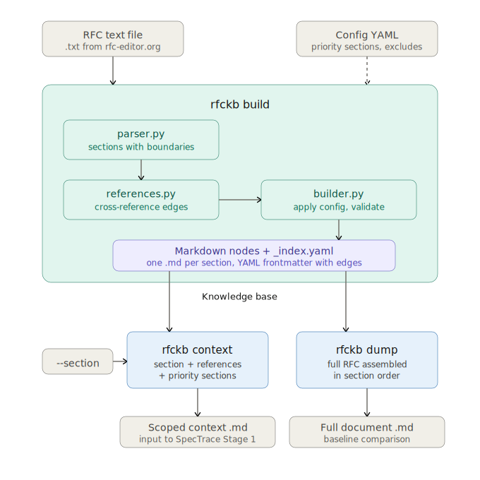

# rfckb - RFC Knowledge Base

A deterministic, LLM-free command-line tool that converts any RFC document into a graph of linked markdown nodes. Each RFC section becomes a standalone `.md` file with YAML frontmatter containing cross-reference edges, parent relationships, and metadata. The tool provides interfaces for querying assembled context, either scoped to a specific section and its references, or as a full document dump.

Built as an input-producing tool for SpecTrace. It does not interpret, classify, or summarize RFC content. All it does is parse, link, and assemble.

## Installation

Requires Python 3.11+.

```bash
cd rfc_knowledge_base
pip install -e .
```

This installs the `rfckb` command globally.

## Prerequisites

The tool works with plain-text RFC files. If you have a PDF, convert it first:

```bash
pdftotext -layout <rfc>.pdf <rfc>.txt
```

## Quick Start

```bash
# 1. Write a config YAML for your RFC (see "Writing a Config" below)

# 2. Build the knowledge base
rfckb build --rfc <rfc>.txt --config <config>.yaml --output kb/<rfc-id>

# 3. Query context for a specific section
rfckb context --kb kb/<rfc-id> --section <section-id> --output context.md

# 4. Or dump the entire RFC as one file
rfckb dump --kb kb/<rfc-id> --output full.md
```

## Commands

### `rfckb build`

Parses an RFC text file into a directory of linked markdown nodes.

```bash
rfckb build --rfc <path-to-rfc.txt> --config <path-to-config.yaml> --output <output-directory>
```

**What it does:**

1. Loads the RFC text and strips page headers/footers using patterns from the config
2. Detects section boundaries (numbered sections and appendices)
3. Extracts internal cross-references between sections (e.g., "see Section 4.2")
4. Extracts external references (e.g., `[RFC6066]`, `[ECDSA]`)
5. Writes one `.md` file per section with YAML frontmatter containing edges
6. Writes an `_index.yaml` listing all sections in document order

**Output structure:**

```
kb/<rfc-id>/
  _index.yaml                  # Section index with metadata
  <rfc-id>-1.md                # Section 1
  <rfc-id>-1-1.md              # Section 1.1
  <rfc-id>-4-2-8.md            # Section 4.2.8 (dots become dashes in filenames)
  <rfc-id>-appendix-A.md       # Appendix A
  ...
```

**Node file format:**

Each `.md` file has YAML frontmatter followed by the verbatim section text:

```yaml
---
rfc_id: <rfc-id>
section_id: "4.2.8"
title: Key Share
depth: 3
parent: "4.2"
is_priority: false
edges:
- target: "4.1.4"
  provenance: "Clients MAY send an empty client_shares vector ... (see Section 4.1.4)."
- target: "4.2.7"
  provenance: "Clients MUST NOT offer any KeyShareEntry values for groups not listed..."
external_references:
- RFC7748
- RFC7919
---

4.2.8.  Key Share

   The "key_share" extension contains the endpoint's cryptographic
   parameters.
   ...
```

The `edges` list is the graph. Each `target` is a section ID that this section references. The `provenance` field records the sentence where the reference appeared, for auditability. The body text below the frontmatter is verbatim from the RFC.

---

### `rfckb context`

Assembles scoped context for a single section.

```bash
rfckb context --kb <kb-directory> --section <section-id> [--output <path>]
```

Reads the target section's edges, then produces a single markdown file containing:

1. **Target section** (tagged `[target]`)
2. **Priority sections** from the config (tagged `[priority]`)
3. **Referenced sections** that the target directly links to via edges (tagged `[referenced]`)

Each section appears at most once. One hop only; it does not follow references of references. If `--output` is omitted, prints to stdout.

**Example:**

```bash
rfckb context --kb kb/rfc8446 --section 4.1.2 --output context_4.1.2.md
```

**Output format:**

```markdown
# Context for <rfc-id> $<section-id> (<title>)

---

## <rfc-id> $<section-id> - <title> [target]

<verbatim section body>

---

## <rfc-id> $<priority-id> - <title> [priority]

<verbatim section body>

---

## <rfc-id> $<ref-id> - <title> [referenced]

<verbatim section body>
```

The role tags (`[target]`, `[priority]`, `[referenced]`) tell downstream tools why each section was included.

---

### `rfckb dump`

Concatenates the entire knowledge base into one markdown file.

```bash
rfckb dump --kb <kb-directory> [--output <path>]
```

All non-excluded sections in document order. No frontmatter, no role tags, no graph traversal. Used for baseline experiments where the full RFC is needed as context. If `--output` is omitted, prints to stdout.

---

## Writing a Config

Every RFC needs its own config YAML. Here is the full schema with explanations:

```yaml
# REQUIRED
rfc_id: rfc8446                    # Identifier used in filenames and frontmatter
rfc_title: "TLS 1.3"              # Human-readable title

# OPTIONAL - sections to always include in context queries
priority_sections:
  - "6.2"                         # e.g., error handling section
  - "9.3"                         # e.g., protocol invariants
# These sections appear in every `rfckb context` output regardless of
# whether the queried section references them. Use this for sections
# that are universally relevant: error codes, compliance requirements,
# security constraints, etc.

# OPTIONAL - sections to exclude from the build entirely
exclude_sections:
  - "10"                          # e.g., Security Considerations
  - "11"                          # e.g., IANA Considerations
  - "12"                          # e.g., References
# Children are excluded automatically (excluding "12" also excludes "12.1", "12.2", etc.).
# Useful for boilerplate sections that add noise without value.

# OPTIONAL - regex patterns for detecting cross-references in text
reference_patterns:
  - pattern: 'Section (\d+(?:\.\d+)*)'
    group: 1
  - pattern: 'Appendix ([A-Z](?:\.\d+)*)'
    group: 1
    prefix: "appendix-"           # matched IDs get this prefix ("A" -> "appendix-A")
# If omitted, the two defaults above are used automatically.
# Add custom patterns if your RFC uses unusual reference styles.

# OPTIONAL - regex patterns for stripping page headers/footers
page_footer_patterns:
  - 'Rescorla\s+Standards Track\s+\[Page \d+\]'
  - 'RFC \d+\s+TLS\s+\w+ \d+'
# These vary per RFC. Open your .txt file and look at the repeated
# lines at the top/bottom of each page. Write regexes to match them.
# If omitted, no stripping is done.
```

**How to write a config for a new RFC:**

1. Open the `.txt` file and note the page header/footer lines that repeat on every page. Write regex patterns for `page_footer_patterns`.
2. Set `rfc_id` to a short identifier (e.g., `rfc9000`) and `rfc_title` to the RFC name.
3. Identify sections to exclude: typically References, IANA Considerations, and similar boilerplate. Add their top-level section numbers to `exclude_sections`.
4. Identify sections that should always be included in context queries. These are sections any reader would need regardless of which part of the RFC they are looking at (error handling, compliance rules, key definitions). Add them to `priority_sections`.
5. The default `reference_patterns` work for most RFCs. Only customize if your RFC uses non-standard cross-reference phrasing.

An example config for RFC 8446 is provided at `examples/rfc8446_config.yaml`.

## Python API

For programmatic use (e.g., importing into another tool):

```python
from rfckb.query import get_context, get_full_document

# Assemble context for a section (same output as `rfckb context`)
markdown = get_context(kb_dir="kb/<rfc-id>", section_id="4.2.8")

# Get full document (same output as `rfckb dump`)
full = get_full_document(kb_dir="kb/<rfc-id>")
```

## Testing

```bash
pytest
pytest -v  # verbose output
```

The test suite uses a small synthetic RFC fixture and covers parsing, reference extraction, knowledge base building (including a determinism check), and context assembly.

## How It Works



The tool is fully deterministic. Same inputs always produce byte-identical outputs. No LLM calls, no timestamps, no nondeterministic ordering.

## Beyond RFCs

While the tool is named `rfckb`, it is not limited to IETF RFCs. It works with any specification document that follows a numbered section structure, as long as the input is plain text. This includes:

- **IETF RFCs** (e.g., RFC 8446, RFC 9000)
- **W3C specifications** (e.g., HTTP Semantics, WebSocket Protocol)
- **IEEE standards**
- **3GPP specifications**
- **ITU-T recommendations**
- **Any internal or proprietary spec** with numbered sections and cross-references like "see Section X.Y"

The only requirements are:

1. The document uses numbered section headings (e.g., `1.  Introduction`, `4.2.8.  Key Share`)
2. Cross-references follow a recognizable pattern (the defaults handle `Section N.N` and `Appendix X`, but custom patterns can be added via config)
3. The input is a plain-text file (convert from PDF using `pdftotext -layout`)

If your specification uses a different heading format or reference style, adjust the `reference_patterns` and `page_footer_patterns` in the config YAML to match.
